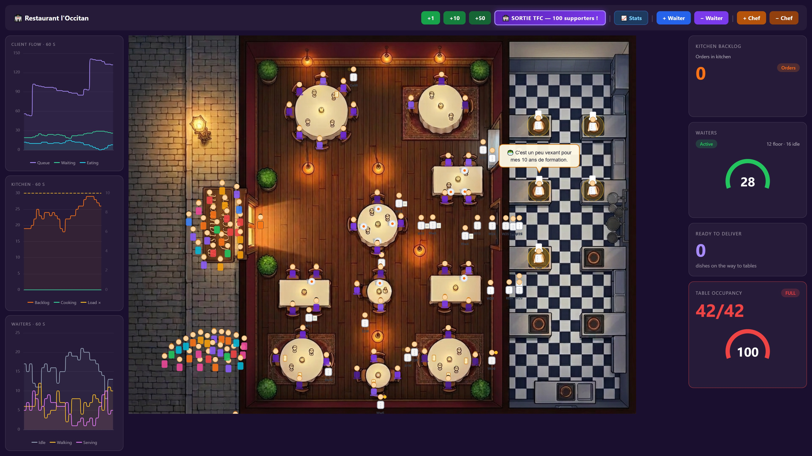
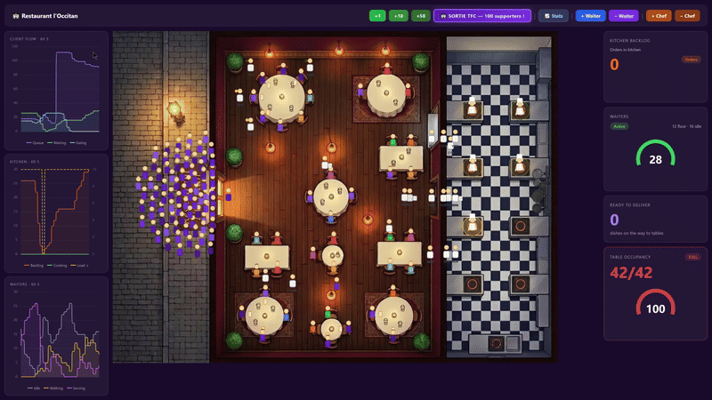
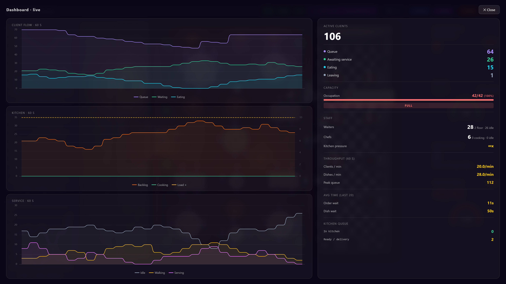
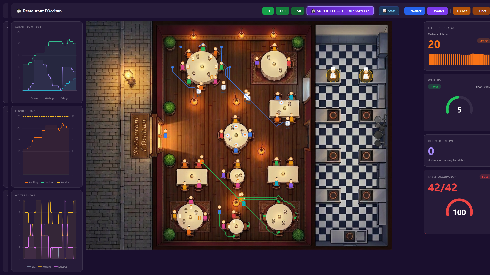
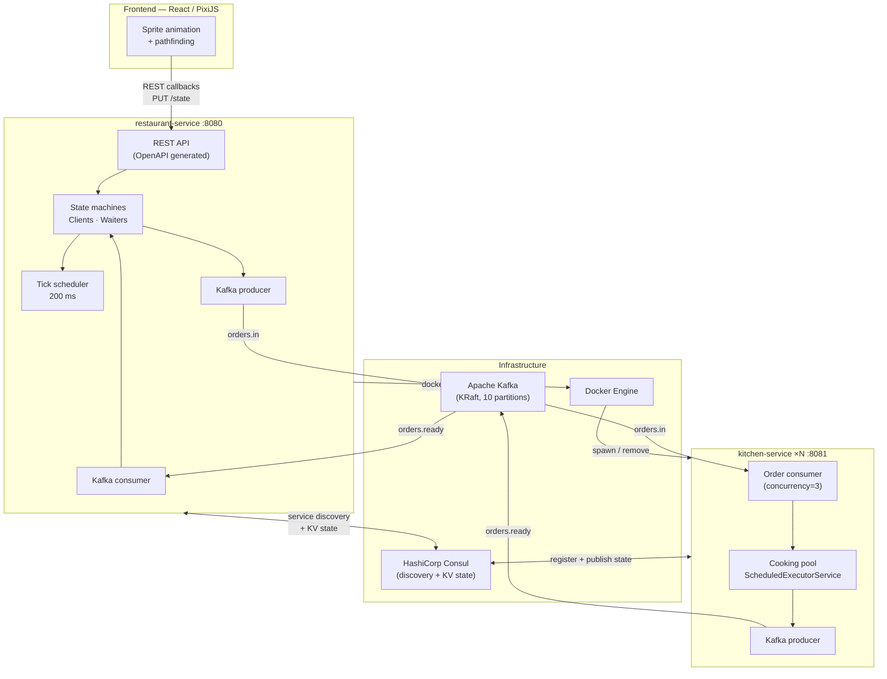
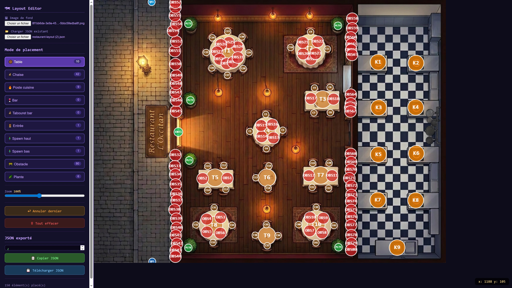
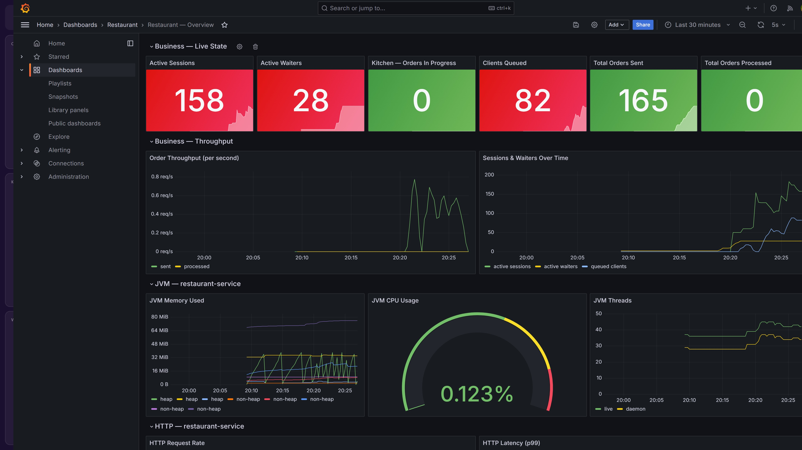

# Event-Driven Restaurant

A real-time restaurant simulation built on an **event-driven architecture**: clients queue, get seated, waiters take orders, kitchen instances cook — all orchestrated through Kafka, Consul, and animated by a WebGL frontend.





[](https://openjdk.org/projects/jdk/21/)
[](https://spring.io/projects/spring-boot)
[](https://kafka.apache.org/)
[](https://react.dev/)
[](https://docs.docker.com/compose/)

---

## Overview

The project simulates a restaurant where every actor (client, waiter, kitchen) is modelled as an independent state machine. The frontend renders the simulation in real time using WebGL sprites (PixiJS) and drives backend state transitions through REST callbacks — the backend only advances a state when the corresponding animation confirms completion.

The kitchen tier is **horizontally scalable**: the restaurant-service spawns and removes kitchen-service Docker containers at runtime by calling Docker Compose through a mounted socket, without any external orchestrator.

The frontend also embeds a **real-time stats modal** with historical charts (client flow, kitchen load, waiter activity) updated every second.



Sprites navigate the floor using **A\* pathfinding** on a tile grid built from the restaurant layout. Press **`P`** to toggle a real-time debug overlay showing each entity's computed path.



---

## Architecture



### Message flow

```
Client arrives
  → Frontend calls  POST /clients
  → Animation runs  → PUT /clients/{id}/state AT_ENTRANCE
  → Waiter assigned → PUT /waiters/{id}/state TAKING_ORDER
  → Order taken     → PUT /waiters/{id}/state WALKING_TO_KITCHEN
                    → Kafka: orders.in
  → Kitchen cooks   → Kafka: orders.ready (after delay)
  → Waiter delivers → PUT /waiters/{id}/state IDLE
  → Client eats     → auto-transition EATING → LEAVING after timeout
```

---

## Design decisions

### Animation-driven state machine

The backend state machines (clients, waiters) only advance when the **frontend animation confirms** the transition. A waiter is considered to have arrived at the table only when the sprite reaches it and calls `PUT /waiters/{id}/state TAKING_ORDER`. This decouples business logic from animation timing without polling.

### Kitchen scaling via Docker Compose

The restaurant-service controls kitchen-service instances by calling `docker compose up --scale` through the Docker socket mounted as a volume. No external orchestrator (Kubernetes, Swarm) is needed for the demo. The desired count is rolled back automatically if the Docker command fails or times out.

### Consul KV for distributed state

Kitchen instances publish their internal state (`STARTING` / `COOKING` / `IDLE`) to Consul KV after every order event. The restaurant-service reads this KV store to aggregate kitchen states without direct HTTP calls between services — Consul acts as a lightweight shared memory.

### Kafka partitioning strategy

`orders.in` has 10 partitions. Orders are routed by a round-robin partition counter, and `max.poll.records=1` ensures each kitchen consumer thread processes one order at a time, matching the visual one-cook-per-order simulation.

### Rescue scheduler

A 200 ms tick detects clients stuck in `WAITING_ORDER` with no assigned waiter (e.g., after a waiter reset mid-task) and force-creates a delivery task after a configurable threshold (default 45 s). This prevents permanent deadlocks without manual intervention.

---

## Project structure

```
event-driven-restaurant/
├── api/
│   └── restaurant-api.yml        # OpenAPI 3.0 contract (source of truth)
├── restaurant-service/           # Spring Boot — floor management, Kafka, Consul proxy
│   └── src/main/java/fr/jr2dallas/
│       ├── config/               # @ConfigurationProperties
│       ├── controllers/          # Generated API implementations + GlobalExceptionHandler
│       ├── domains/              # State machines: ClientSession, WaiterWorker, Restaurant
│       ├── mappers/              # Domain → DTO mappers
│       └── services/             # RestaurantService, WaiterScheduler, ConsulService, …
├── kitchen-service/              # Spring Boot — order processing, horizontal scaling
│   └── src/main/java/fr/jr2dallas/
│       ├── controllers/          # Internal state endpoint + GlobalExceptionHandler
│       └── services/             # KitchenService, OrderConsumer
├── frontend/                     # React 19 + PixiJS 8 + Zustand
│   ├── scripts/
│   │   └── layout-editor.html   # Visual editor — generates restaurant-layout.json
│   └── src/
│       ├── components/           # LeftPanel (controls), RightPanel (metrics)
│       ├── pathfinding/          # A* nav grid + seat resolver
│       └── store/                # Zustand stores (restaurant state, waiter sprites)
└── docker-compose.yml
```

---

## Layout editor

`frontend/scripts/layout-editor.html` is a standalone visual tool for mapping a restaurant floor plan image to the constraint file consumed by the pathfinding engine.

**Open it directly in a browser — no server or dependencies required.**



### Workflow

1. Load any restaurant image as background
2. Click to place elements on the canvas (tables, chairs, kitchen stations, obstacles, entrance, queue spawn points, etc.)
3. Each click generates a typed, auto-incremented ID (`chair_1`, `table_2`, …)
4. Zoom in/out for precision placement — pixel coordinates are shown in real time
5. Undo last placement or clear all if needed
6. Load an existing JSON to continue editing a previous layout
7. Download `restaurant-layout.json`

### Output format

```json
{
  "chair":           [{ "id": "chair_1",   "x": 312, "y": 204, "r": 11 }],
  "table":           [{ "id": "table_1",   "x": 312, "y": 180, "r": 30 }],
  "kitchen_station": [{ "id": "kitchen_station_1", "x": 600, "y": 100, "r": 27 }],
  "entrance":        [{ "id": "entrance_1", "x": 80,  "y": 448, "r": 15 }],
  "obstacle":        [{ "id": "obstacle_1", "x": 150, "y": 300, "r": 20 }]
}
```

This file is consumed by `buildNavGrid.ts` (which converts each element to blocked/passable tiles on the A\* grid) and `resolveSeatsFromLayout.ts` (which pre-computes waiter service positions for each chair).

---

## Quick start

**Prerequisites:** Docker + Docker Compose

```bash
git clone https://github.com/jr2dallas/event-driven-restaurant.git
cd event-driven-restaurant
docker compose up
```

Open [http://localhost:3000](http://localhost:3000).

> First build takes ~2 minutes (Maven + npm). Subsequent starts are faster thanks to Docker layer caching.

---

## Configuration

Copy `.env.example` to `.env` before starting:

```bash
cp .env.example .env
```

### Environment variables

| Variable | Default | Description |
|---|---|---|
| `SPRING_LOG_LEVEL` | `WARN` | Log level for both Spring services |
| `CONSUL_LOG_LEVEL` | `warn` | Log level for Consul agent |
| `KITCHEN_SCALING_COMPOSE_DIR` | `./` | Path to the directory containing `docker-compose.yml` |
| `CORS_ALLOWED_ORIGINS` | `http://localhost:3000,http://localhost:5173` | Allowed frontend origins |

### Debug mode

```bash
# Linux / macOS
SPRING_LOG_LEVEL=DEBUG docker compose up

# PowerShell
$env:SPRING_LOG_LEVEL="DEBUG"; docker compose up
```

### Kitchen scaling

The number of kitchen instances can be adjusted from the UI at runtime, or set at startup:

```bash
docker compose up --scale kitchen-service=3
```

---

## Services & ports

| Service | Port | Notes |
|---|---|---|
| Frontend | 3000 | React SPA |
| restaurant-service | 8080 | REST API + Actuator (`/actuator/health`) |
| Swagger UI | 8080 | `/swagger-ui.html` — full REST contract |
| kitchen-service | 8081 | Internal only (no external port) |
| Kafka | 9093 | External listener (localhost dev) |
| Consul | 8500 | UI at `http://localhost:8500/ui` |
| Prometheus | 9090 | Metrics scraping (restaurant + kitchen) |
| Grafana | 3001 | Dashboards — admin / admin |

---

## Observability

Prometheus scrapes both services every 15 seconds. A Grafana dashboard is auto-provisioned at startup under **Restaurant → Restaurant Overview** (http://localhost:3001, admin / admin).



**Business metrics exposed:**

| Metric | Description |
|---|---|
| `restaurant_sessions_active` | Live client sessions |
| `restaurant_clients_queued` | Clients waiting at the entrance |
| `restaurant_waiters_active` | Active waiter workers |
| `restaurant_orders_sent_total` | Orders successfully sent to Kafka |
| `restaurant_orders_failed_total` | Orders that failed Kafka send |
| `kitchen_orders_active` | Orders currently cooking (all replicas) |
| `kitchen_orders_processed_total` | Total orders cooked |

Standard JVM, HTTP latency (p50/p99), and Kafka consumer lag metrics are also available.

See [`observability/README.md`](observability/README.md) for dashboard details and how to extend the monitoring setup.

---

## Tests

```bash
cd restaurant-service && ./mvnw test
cd kitchen-service   && ./mvnw test
```

| Scope | What is tested |
|---|---|
| Domain unit tests | `ClientSession`, `Restaurant`, `WaiterWorker` full lifecycles |
| Service unit tests | `WaiterScheduler` tick logic, hire/fire, rescue path |
| Web layer (`@WebMvcTest`) | All controllers — happy path, 400/404 error cases |
| Kitchen service | `KitchenService` cooking pool, order consumer wiring |

---

## Tech stack

| Layer | Technology | Version |
|---|---|---|
| Frontend | React + PixiJS + Zustand + Tailwind | React 19, PixiJS 8 |
| Pathfinding | EasyStar.js (A*) | 0.4 |
| Backend | Spring Boot | 3.4 |
| Messaging | Apache Kafka (KRaft — no ZooKeeper) | 7.6 (Confluent) |
| Service registry | HashiCorp Consul | 1.21 |
| API contract | OpenAPI 3.0 (code generation for Java + TypeScript) | — |
| Observability | Micrometer + Prometheus + Grafana | — |
| Containerisation | Docker Compose | — |
| Language | Java 21, TypeScript 5.7 | — |
